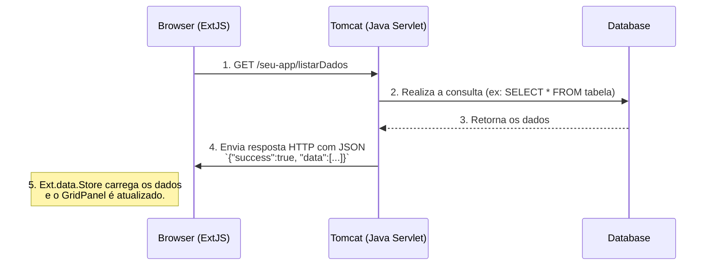
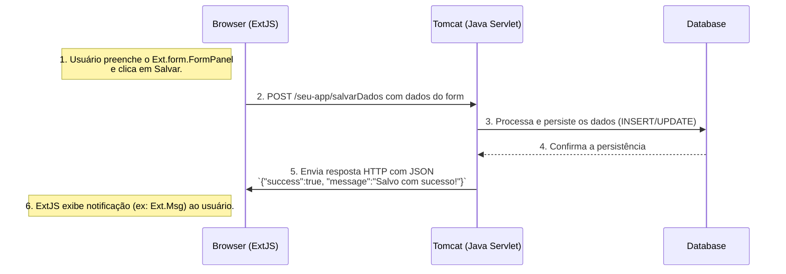

# Teste Amazon Q

## 1\. Descrição

Este projeto é uma aplicação web desenvolvida com o framework **ExtJS** e **Java**. A aplicação é renderizada em uma página JSP e executada em um servidor Apache Tomcat 9. O objetivo é simular um ambiente com tecnologias e versões semelhantes **à** aplicação **principal** da empresa para testes de migração e modernização do sistema.

### Aplicação principal da empresa

A aplicação principal da empresa é legada e antiga. Não está tão bem organizada, e é muito maior e mais caótica. Este projeto-piloto é um estudo para orientar a modernização da aplicação principal. Visa validar que podemos usar o Amazon Q para nos auxiliar com as tecnologias legadas e aprender um pouco mais sobre a ferramenta em um cenário mais alinhado com a nossa realidade.

## 2\. Tecnologias Utilizadas

* **Frontend**: ExtJS 3.4
* **Backend**: Java 8 (Servlets/JSP)
* **Servidor de Aplicação**: Apache Tomcat 9

## 3\. Arquitetura e Fluxo de Integração

Há uma integração entre o frontend ExtJS e o backend em Java. O ExtJS é responsável por toda a UI e interação com o usuário, e o Java atua como um serviço de API, fornecendo e recebendo dados.

### Visão Geral da Arquitetura

1. **Browser (Cliente)**: O usuário acessa uma página JSP. Esta página serve principalmente como um contêiner para carregar as bibliotecas ExtJS e os arquivos JavaScript da aplicação.
2. **Frontend (ExtJS)**: Uma vez carregado, o JavaScript (ExtJS) assume o controle. Ele renderiza toda a interface do usuário (grids, formulários, painéis) dinamicamente no corpo da página JSP.
3. **Servidor (Tomcat)**: O Tomcat hospeda a aplicação, compilada como um arquivo `.war`, e gerencia o ciclo de vida das requisições HTTP, direcionando-as para os Servlets apropriados.

### Fluxo de Requisição de Dados (Ex: Carregar um Grid)

Quando um componente ExtJS, como um `GridPanel`, precisa exibir dados, ele inicia um fluxo de requisição assíncrona.



**Passo a Passo:**

1. **Componente ExtJS**: Um `Ext.grid.GridPanel` é configurado com um `Ext.data.Store` (por exemplo, `JsonStore`).
2. **Proxy**: O `Store` possui um `Proxy` (geralmente `HttpProxy` ou `AjaxProxy`) configurado com a URL do endpoint Java (ex: `/seu-app/listarDados`).
3. **Requisição**: Ao ser carregado, o `Store` utiliza o `Proxy` para fazer uma requisição AJAX (GET) para a URL especificada.
4. **Servlet Java**: O Tomcat direciona a requisição para o Servlet Java mapeado para essa URL. O Servlet processa a requisição, busca os dados no banco de dados e os serializa para o formato JSON.
5. **Resposta JSON**: O Servlet retorna uma resposta HTTP com `Content-Type: application/json` e o payload JSON. Uma estrutura de resposta típica que o ExtJS espera é: `{ "success": true, "total": 50, "data": [...] }`.
6. **Reader**: O `Store` do ExtJS usa seu `Reader` (ex: `JsonReader`) para ler a resposta JSON, interpretar a estrutura e criar instâncias de `Ext.data.Record`.
7. **Renderização**: O `Store` notifica o `GridPanel` de que os dados foram carregados, e o grid se renderiza, exibindo os dados em linhas e colunas.

### Fluxo de Submissão de Dados (Ex: Salvar um Formulário)

Quando o usuário preenche um formulário e clica em "Salvar", um fluxo de submissão de dados é iniciado.



**Passo a Passo:**

1. **Formulário ExtJS**: O usuário interage com um `Ext.form.FormPanel`.
2. **Ação de Submissão**: Ao clicar no botão "Salvar", a função handler associada é chamada. Esta função utiliza o método `form.submit()` do `FormPanel`.
3. **Requisição AJAX**: O método `submit()` faz uma requisição AJAX (POST) para a URL configurada no `FormPanel` (ex: `/seu-app/salvarDados`), enviando os dados dos campos do formulário no corpo da requisição.
4. **Servlet Java**: O Servlet correspondente recebe os dados do formulário, valida-os e executa a lógica de negócios para salvar as informações no banco de dados.
5. **Resposta de Sucesso/Falha**: O Servlet retorna uma resposta JSON indicando o resultado da operação, por exemplo: `{ "success": true, "message": "Dados salvos com sucesso!" }` ou `{ "success": false, "errors": {"campo": "Mensagem de erro"} }`.
6. **Callback do ExtJS**: A submissão no ExtJS é configurada com callbacks de `success` e `failure`. Com base na resposta do servidor, o callback apropriado é executado, permitindo, por exemplo, exibir uma mensagem de sucesso ao usuário com `Ext.Msg` ou tratar os erros.


## 4\. Autenticação

A aplicação implementa um sistema de autenticação robusto com as seguintes características:

- **Interface de Login**: Desenvolvida com ExtJS, permite ao usuário inserir seu nome de usuário e senha.
- **Processamento no Backend**:
    - O `LoginServlet` processa a requisição e valida as credenciais usando o DAO (`UserDAO`).
    - As senhas são protegidas com hashing utilizando o algoritmo `BCrypt`.
- **Sessão HTTP**: Ao autenticar-se com sucesso, uma sessão é criada e o usuário tem acesso às funcionalidades protegidas.
- **Proteção de Rotas**:
    - O `AuthenticationFilter` garante que apenas usuários autenticados possam acessar as rotas protegidas da aplicação.
    - Usuários não autenticados são redirecionados automaticamente para a tela de login (`index.jsp`).

Este mecanismo reflete práticas comuns em sistemas legados com JSP/Servlets, fornecendo controle de acesso baseado em sessão e segurança de senha com hash.

## 5\. Deploy no Tomcat (.war)

A aplicação é empacotada como um arquivo **WAR** (Web Application Archive) para deploy no Apache Tomcat.

1. **Estrutura do Projeto**: O projeto Java deve seguir a estrutura padrão de uma aplicação web para que possa ser empacotado corretamente. Os arquivos ExtJS (bibliotecas e código da aplicação) são incluídos como recursos estáticos, geralmente dentro de um diretório como `src/main/webapp/extjs`.
2. **Build**: O processo de build (usando Maven) compila as classes Java, agrupa os arquivos JSP, os arquivos de configuração (`web.xml`) e os recursos estáticos (JS, CSS) em um único arquivo `.war`.
3. **Deploy**: O arquivo `.war` gerado é então copiado para o diretório `webapps` do Tomcat. O Tomcat descompacta e implanta a aplicação, tornando-a acessível pela URL configurada (ex: `http://localhost:8080/nome-do-projeto`).

### Configuração do Banco de Dados

A conexão com o banco de dados é centralizada e configurável:

* **Conexão**: É configurada em `src/main/webapp/META-INF/context.xml`. O tomcat gerencia as coneções e acessos ao database.
* **Driver**: O `pom.xml` inclui a dependência do driver JDBC do PostgreSQL, que é essencial para a comunicação.

#### Database Configuration

```
<?xml version="1.0" encoding="UTF-8"?>
<Context>
    <Resource
            name="jdbc/PostgresDB"
            auth="Container"
            type="javax.sql.DataSource"
            driverClassName="org.postgresql.Driver"
            url="jdbc:postgresql://localhost:4589/database"
            username="user"
            password="senha"
            maxTotal="20"
            maxIdle="10"
            maxWaitMillis="10000"
    />
</Context>
```
