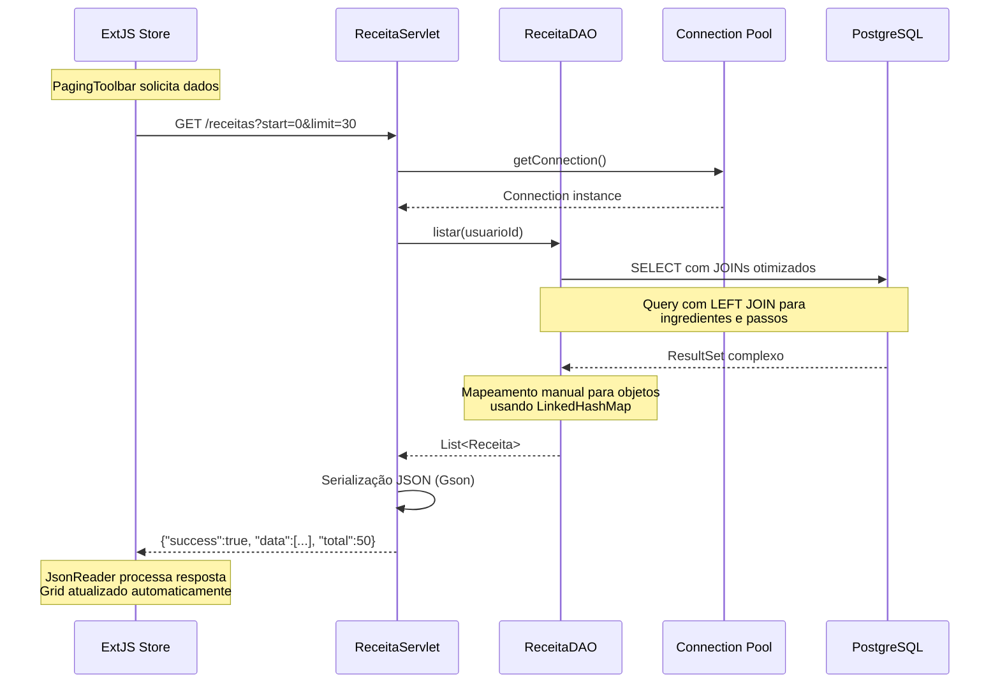
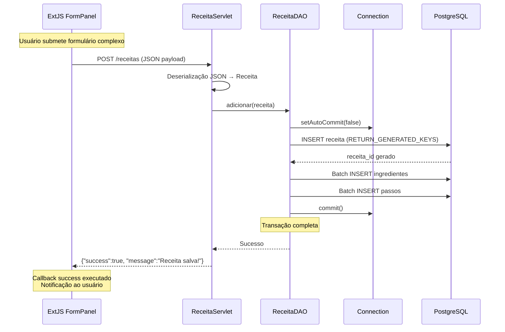
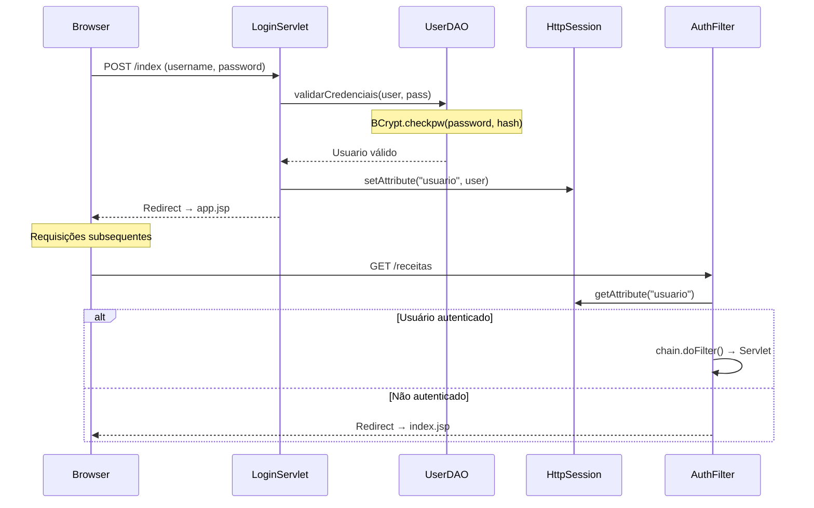
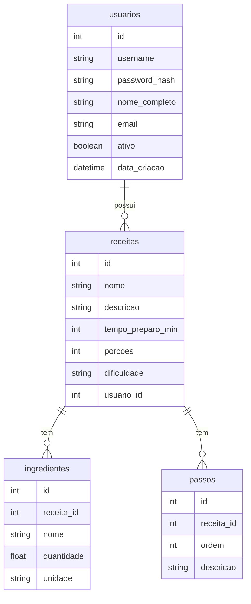

# Arquitetura do Sistema - Gerenciador de Receitas

## Visão Geral

Sistema web monolítico para gerenciamento de receitas culinárias, implementado com usando tecnologias Java Web tradicionais e ExtJS 3.4 no frontend.

### Stack Tecnológica
- **Frontend**: ExtJS 3.4, JavaScript ES5, CSS
- **Backend**: Java Servlets, JDBC puro
- **Servidor**: Apache Tomcat (container-managed resources)
- **Banco de Dados**: PostgreSQL
- **Pool de Conexões**: Tomcat DBCP via JNDI
- **Build/Deploy**: Maven → arquivo .war

## Arquitetura Monolítica em Camadas

```
┌────────────────────────────────────────────────────────────────┐
│                        MONÓLITO (.war)                         │
├────────────────────────────────────────────────────────────────┤
│  PRESENTATION LAYER                                            │
│  ┌─────────────────┐    ┌─────────────────┐                    │
│  │   index.jsp     │    │    app.jsp      │                    │
│  │ (Login Shell)   │    │  (App Shell)    │                    │
│  │   <body></body> │    │  <body></body>  │                    │
│  └─────────────────┘    └─────────────────┘                    │
│ ┌────────────────────────────────────────────────────────────┐ │
│ │              ExtJS 3.4 Frontend (SPA)                      │ │
│ │  ┌─────────────┐ ┌─────────────┐ ┌─────────────┐           │ │
│ │  │    Views    │ │   Stores    │ │   Models    │           │ │
│ │  │(UI criada   │ │ (Dados via  │ │ (Estruturas │           │ │
│ │  │dinamicament)│ │   AJAX)     │ │ de dados)   │           │ │
│ │  └─────────────┘ └─────────────┘ └─────────────┘           │ |
│ └────────────────────────────────────────────────────────────┘ │
├────────────────────────────────────────────────────────────────┤
│  CONTROLLER LAYER                                              │
│  ┌────────────────────────────────────────────────────────────┐│
│  │                   Java Servlets                            │|
│  │  ReceitaServlet │ LoginServlet │ UsuarioServlet │ Logout   │|
│  └────────────────────────────────────────────────────────────┘│
├────────────────────────────────────────────────────────────────┤
│  BUSINESS/DATA ACCESS LAYER                                    │
│  ┌───────────────────────────────────────────────────────────┐ │
│  │                    DAO Pattern                            │ │
│  │      ReceitaDAO │ UserDAO (JDBC puro)                     │ │
│  └───────────────────────────────────────────────────────────┘ │
├────────────────────────────────────────────────────────────────┤
│  INFRASTRUCTURE LAYER                                          │
│  ┌───────────────────────────────────────────────────────────┐ │
│  │  AppLifecycleListener │ AuthenticationFilter │ DataSource │ │
│  └───────────────────────────────────────────────────────────┘ │
└────────────────────────────────────────────────────────────────┘
                                │
                                ▼
                    ┌─────────────────────────┐
                    │     PostgreSQL          │
                    │   (External Database)   │
                    └─────────────────────────┘
```

## O Papel dos JSPs - Application Shells

### Conceito Fundamental
Os arquivos JSP, que geralmente são usados pra renderizam HTML no servidor, nesse projeto funcionam como **"Application Shells"** - containers HTML mínimos que existem apenas para carregar o ExtJS e inicializar a aplicação JavaScript.

### index.jsp - Shell de Login
```jsp
<%@ page ... %>
<!DOCTYPE html>
<html>
<head>
    <!-- Carrega ExtJS e dependências -->
    <script src="extjs/ext-all-debug.js"></script>
    <script src="js/login.js"></script>
</head>
<body>
    <!-- CORPO COMPLETAMENTE VAZIO -->
    <!-- Interface criada 100% via JavaScript -->
</body>
</html>
```

**Fluxo:**
1. Browser carrega HTML vazio + ExtJS
2. `login.js` executa `Ext.onReady()`
3. ExtJS cria interface de login dinamicamente
4. Após autenticação, JavaScript redireciona para `app.jsp`

### app.jsp - Shell da Aplicação
```jsp
<%@ page ... %>
<!DOCTYPE html>
<html>
<head>
    <script src="extjs/ext-all-debug.js"></script>
    <script src="js/app-loader.js"></script>
</head>
<body>
    <!-- CORPO COMPLETAMENTE VAZIO -->
    <!-- Aplicação completa criada via ExtJS -->
</body>
</html>
```

**Fluxo:**
1. `app-loader.js` carrega todos os componentes
2. `Ext.Viewport` é criado ocupando 100% da tela
3. Grid principal e toda UI renderizada dinamicamente

## Componentes da Arquitetura

**Características:**
- **UI**: Renderizada dinamicamente via JavaScript
- **Arquitetura**: Views, Stores, Models separados
- **Comunicação assíncrona**: AJAX para todas as operações CRUD
- **Componentes ricos**: GridPanel, FormPanel, Window com funcionalidades avançadas

**Estrutura:**
```
js/app/
├── model/
│   └── models.js              # Definições os modelos de dados (Ext.data.Record)
├── store/
│   └── ReceitaStore.js        # Faz a requisição dos dados de receitas e armazena na store
└── view/
    ├── ReceitaGrid.js         # Grid principal com paginação que lista todas as receitas do usuario logado
    ├── ReceitaWindow.js       # Formulário que abre uma receita especifica listada em ReceitaGrid
    ├── UsuarioWindow.js       # Tela pra criar um novo usuario
    └── ConfiguracoesWindow.js # Tela pra que o usuario exlua sua conta
```

**Padrão Arquitetural:**
- **Controller Pattern**: Servlets como pontos de entrada HTTP
- **DAO Pattern**: Separação clara entre lógica de negócio e acesso a dados
- **Resource Management**: Pool de conexões gerenciado pelo container

**Servlets (Controllers):**
```java
ReceitaServlet    → /receitas     # Deletar, adcionar e editar receitas
LoginServlet      → /index        # Autenticação
UsuarioServlet    → /usuarios/*   # Cadastro e exclusão de usuario
LogoutServlet     → /logout       # Encerramento de sessão
```

**DAOs (Data Access):**
- **JDBC Puro**: Sem ORM, controle total sobre SQL
- **Connection Pooling**: Reutilização eficiente de conexões

**DataSource via JNDI:**
```xml
<!-- META-INF/context.xml -->
<Context>
    <Resource name="jdbc/PostgresDB"
              auth="Container"
              type="javax.sql.DataSource"
              driverClassName="org.postgresql.Driver"
              url="jdbc:postgresql://localhost:4589/database"
              username="user"
              password="senha"
              maxTotal="20"
              maxIdle="10"
              maxWaitMillis="10000" />
</Context>
```

**Lifecycle Management:**
```java
@WebListener
public class AppLifecycleListener implements ServletContextListener {
    @Override
    public void contextInitialized(ServletContextEvent sce) {
        // 1. JNDI lookup do DataSource (apenas uma vez)
        Context envContext = (Context) new InitialContext().lookup("java:/comp/env");
        DataSource dataSource = (DataSource) envContext.lookup("jdbc/PostgresDB");
        
        // 2. Armazena no ServletContext como registry global
        sce.getServletContext().setAttribute("dataSource", dataSource);
    }
}
```

## Fluxos de Dados Detalhados

### 1. Carregamento de Grid com Paginação



**Detalhes Técnicos:**
- **Query Otimizada**: Single query com LEFT JOINs para evitar N+1 queries
- **Mapeamento Eficiente**: LinkedHashMap para agrupar dados relacionados
- **Serialização**: Gson para conversão automática Java → JSON
- **Paginação**: ExtJS PagingToolbar integrado com backend

### 2. Operação CRUD Transacional



**Características Transacionais:**
- **ACID Compliance**: Transações manuais com rollback automático
- **Batch Processing**: Inserções em lote para ingredientes/passos
- **Generated Keys**: Recuperação automática de IDs gerados
- **Error Handling**: Try-catch com rollback em caso de falha

## Segurança e Autenticação

### Fluxo de Autenticação


**Implementação de Segurança:**
- **Password Hashing**: BCrypt para proteção de senhas
- **Session Management**: HttpSession para estado de autenticação
- **Route Protection**: AuthenticationFilter intercepta requisições protegidas
- **Automatic Redirect**: Redirecionamento transparente para login

## Modelo de Dados

### Estrutura Relacional

**Minhas tabelas de banco de dados são:**

#### Tabela *Usuarios*:

```sql
CREATE TABLE usuarios (
	id serial4 NOT NULL,
	username varchar(50) NOT NULL,
	password_hash varchar(255) NOT NULL,
	nome_completo varchar(100) NULL,
	email varchar(100) NULL,
	ativo bool DEFAULT true NULL,
	data_criacao timestamptz DEFAULT CURRENT_TIMESTAMP NULL,
	CONSTRAINT usuarios_email_key UNIQUE (email),
	CONSTRAINT usuarios_pkey PRIMARY KEY (id),
	CONSTRAINT usuarios_username_key UNIQUE (username)
);
```

#### Tabela *Receitas*:

```sql
CREATE TABLE receitas (
	id serial4 NOT NULL,
	nome varchar(255) NOT NULL,
	descricao text NULL,
	tempo_preparo_min int4 NULL,
	porcoes int4 NULL,
	dificuldade varchar(50) NULL,
	usuario_id int4 NULL,
	CONSTRAINT receitas_pkey PRIMARY KEY (id),
	CONSTRAINT fk_usuario FOREIGN KEY (usuario_id) REFERENCES usuarios(id)
);

```

#### Tabela *Ingredientes*:

```sql
CREATE TABLE ingredientes (
	id serial4 NOT NULL,
	receita_id int4 NULL,
	nome varchar(255) NOT NULL,
	quantidade float8 NULL,
	unidade varchar(50) NULL,
	CONSTRAINT ingredientes_pkey PRIMARY KEY (id),
	CONSTRAINT ingredientes_receita_id_fkey FOREIGN KEY (receita_id) REFERENCES receitas(id) ON DELETE CASCADE
);
```

#### Tabela *Passos*:

```sql
CREATE TABLE passos (
	id serial4 NOT NULL,
	receita_id int4 NULL,
	ordem int4 NOT NULL,
	descricao text NOT NULL,
	CONSTRAINT passos_pkey PRIMARY KEY (id),
	CONSTRAINT passos_receita_id_fkey FOREIGN KEY (receita_id) REFERENCES receitas(id) ON DELETE CASCADE
);
```

#### Diagrama de relacionamento das tabelas em mermaid:



#### Mapeamento Objeto-Relacional Manual
```java
// Sem ORM - Mapeamento manual otimizado
public List<Receita> listar(int usuarioId) throws SQLException {
    Map<Integer, Receita> mapaDeReceitas = new LinkedHashMap<>();
    
    String sql = "SELECT r.id, r.nome, r.descricao, " +
                 "i.nome AS ingrediente_nome, i.quantidade, i.unidade, " +
                 "p.ordem, p.descricao AS passo_descricao " +
                 "FROM receitas r " +
                 "LEFT JOIN ingredientes i ON r.id = i.receita_id " +
                 "LEFT JOIN passos p ON r.id = p.receita_id " +
                 "WHERE r.usuario_id = ? " +
                 "ORDER BY r.nome ASC, p.ordem ASC";
    
    // Single query com JOINs
    // Mapeamento eficiente evitando duplicação de dados
    // Agrupamento por receita_id usando LinkedHashMap
}
```

## Configuração e Deploy

### Estrutura do Projeto Maven
```
src/main/
├── java/org/avsytem/
│   ├── controller/          # Servlets (Controllers)
│   │   ├── LoginServlet.java
│   │   ├── ReceitaServlet.java
│   │   ├── UsuarioServlet.java
│   │   └── LogoutServlet.java
│   ├── dao/                 # Data Access Objects
│   │   ├── ReceitaDAO.java
│   │   └── UserDAO.java
│   ├── model/               # POJOs (Domain Objects)
│   │   ├── Receita.java
│   │   ├── Ingrediente.java
│   │   └── Passo.java
│   ├── security/            # Filtros de segurança
│   │   └── AuthenticationFilter.java
│   └── listener/            # Lifecycle management
│       └── AppLifecycleListener.java
└── webapp/
    ├── META-INF/
    │   └── context.xml      # Configuração DataSource
    ├── WEB-INF/
    │   └── web.xml          # Servlet mappings
    ├── extjs/               # Biblioteca ExtJS 3.4
    ├── js/
    │   ├── app/             # Código da aplicação
    │   ├── app-loader.js    # Carregador da aplicação
    │   └── login.js         # Interface de login
    ├── css/                 # Estilos customizados
    ├── index.jsp            # Shell de login
    └── app.jsp              # Shell da aplicação
```

### Configurações Críticas

**web.xml - Servlet Mappings:**
```xml
<web-app version="4.0">
    <!-- Servlets -->
    <servlet>
        <servlet-name>ReceitaServlet</servlet-name>
        <servlet-class>org.avsytem.controller.ReceitaServlet</servlet-class>
    </servlet>
    <servlet-mapping>
        <servlet-name>ReceitaServlet</servlet-name>
        <url-pattern>/receitas</url-pattern>
    </servlet-mapping>

    <!-- Filtros de Segurança -->
    <filter>
        <filter-name>AuthenticationFilter</filter-name>
        <filter-class>org.avsytem.security.AuthenticationFilter</filter-class>
    </filter>
    <filter-mapping>
        <filter-name>AuthenticationFilter</filter-name>
        <url-pattern>*.jsp</url-pattern>
        <url-pattern>/receitas/*</url-pattern>
    </filter-mapping>

    <!-- Página inicial -->
    <welcome-file-list>
        <welcome-file>index.jsp</welcome-file>
    </welcome-file-list>
</web-app>
```

## Padrões Arquiteturais Implementados

### 1. **MVC (Model-View-Controller)**
- **Model**: POJOs + DAOs para persistência
- **View**: ExtJS components (client-side rendering)
- **Controller**: Java Servlets processando HTTP

### 2. **DAO (Data Access Object)**
- Separação clara entre lógica de negócio e acesso a dados
- Encapsulamento de operações SQL complexas
- Reutilização de código de persistência

### 3. **Front Controller Pattern**
- Servlets como pontos de entrada únicos por funcionalidade
- Roteamento baseado em URL patterns
- Processamento centralizado de requisições

### 4. **Application Shell Pattern**
- JSPs como containers mínimos para carregar JavaScript
- Separação total entre server-side e client-side

### 5. **Dependency Injection Manual**
- DataSource injetado via ServletContext
- Lifecycle gerenciado por ServletContextListener
- Recursos compartilhados entre componentes

## Endpoints da API

| Método| Endpoint | Descrição| Parâmetros|
|-------|----------|------------|-----------|
| GET | `/receitas`| Lista receitas do usuário|- |
| POST | `/receitas`| Se id=0, criar receita. Caso contrario, atualiza receita de id correspondente. Se parametro `action` igual a "deletar",     deleta receita passada| `action` com a acão que deve ser executada|
| POST| `/index`| Autenticação de usuário| - |
| POST| `/logout`| Encerra sessão | - |
| POST | `/usuarios/`| Cria Usuarios | - |
| DELETE| `/usuarios/` | Deleta usuario logado| - 
