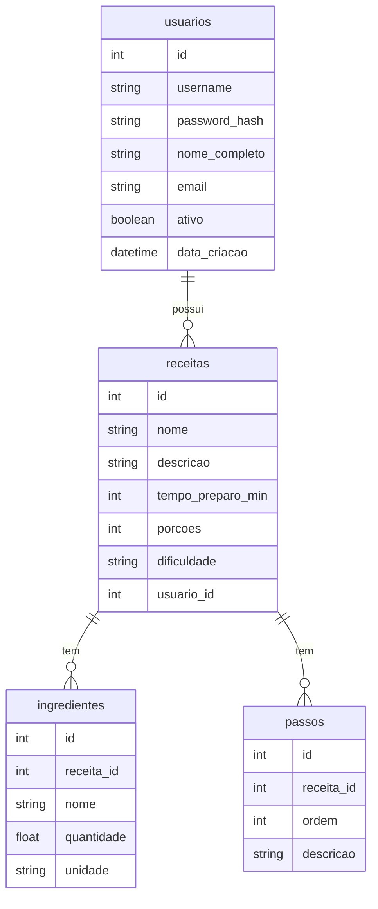
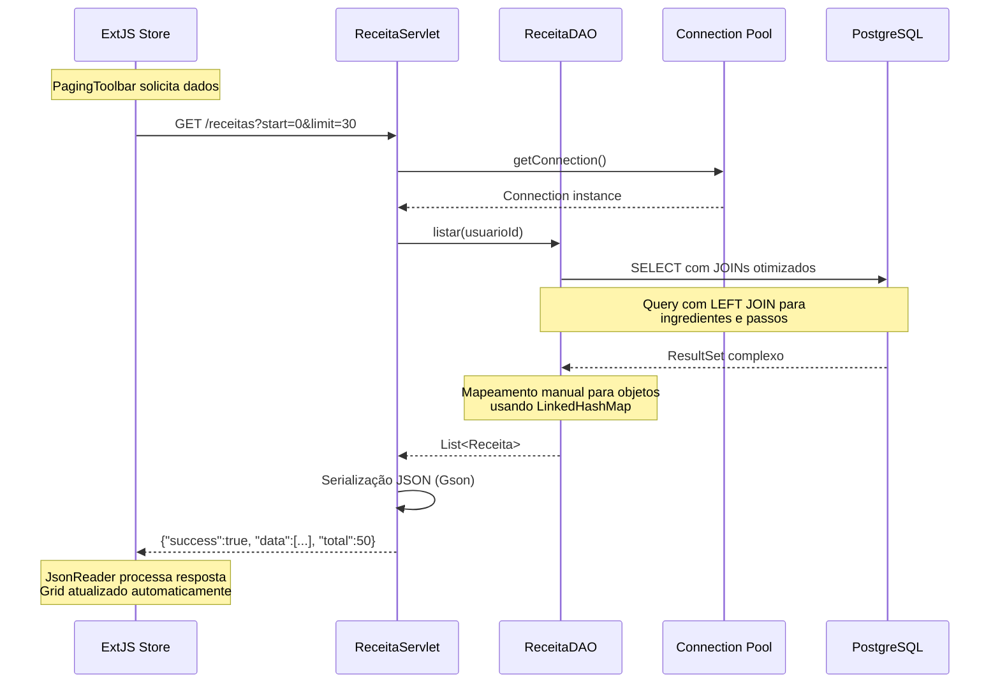
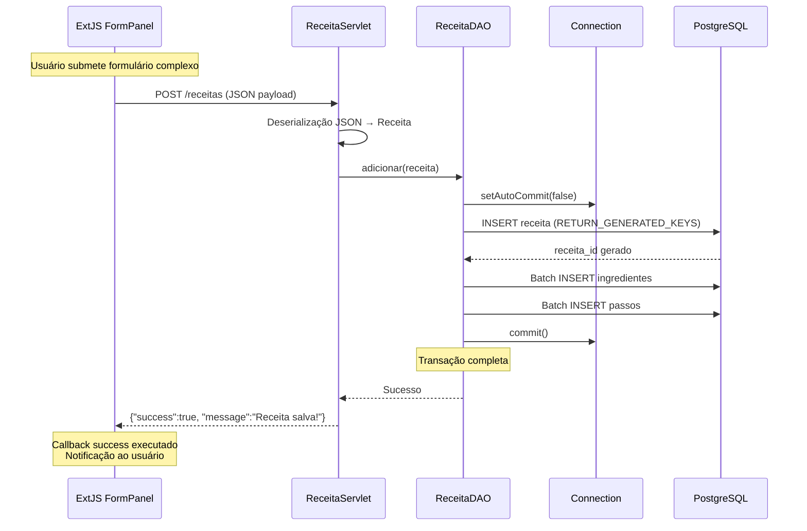
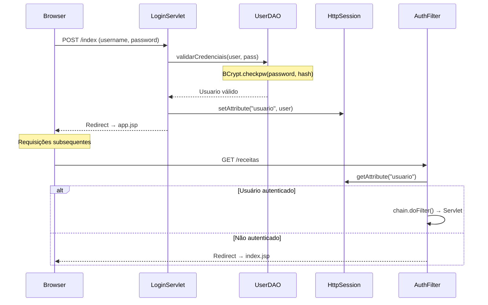
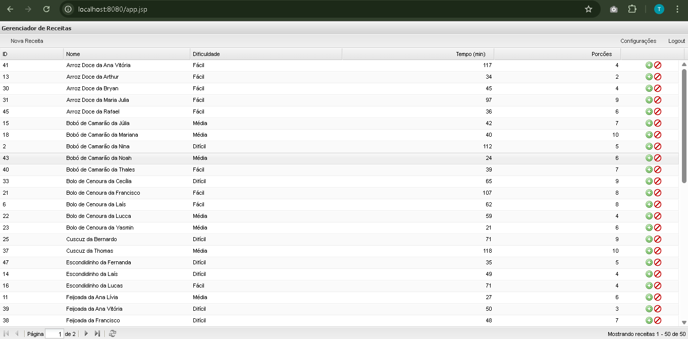
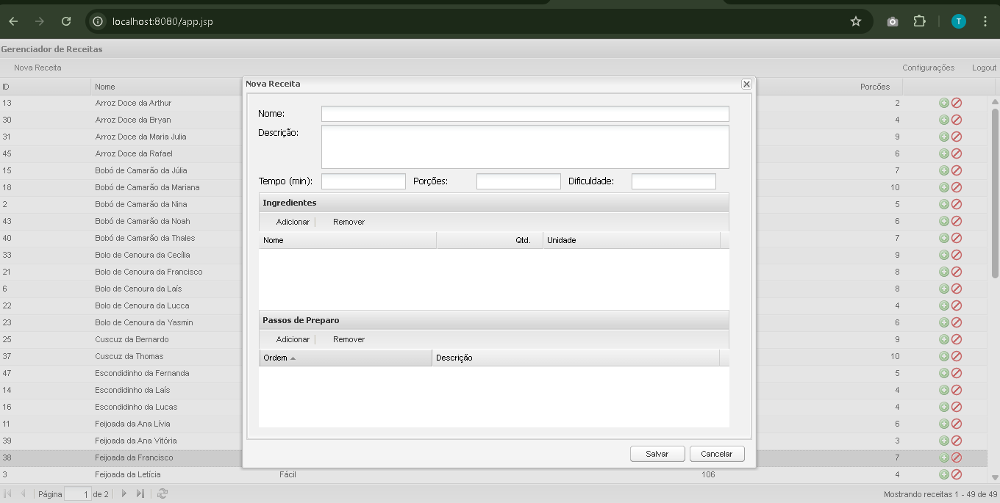
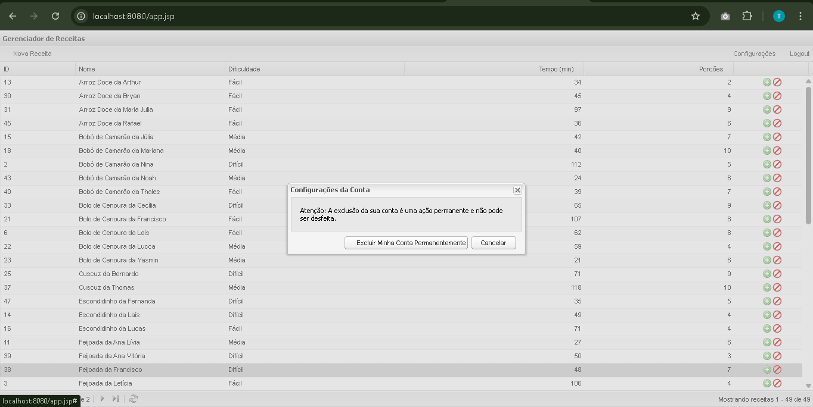
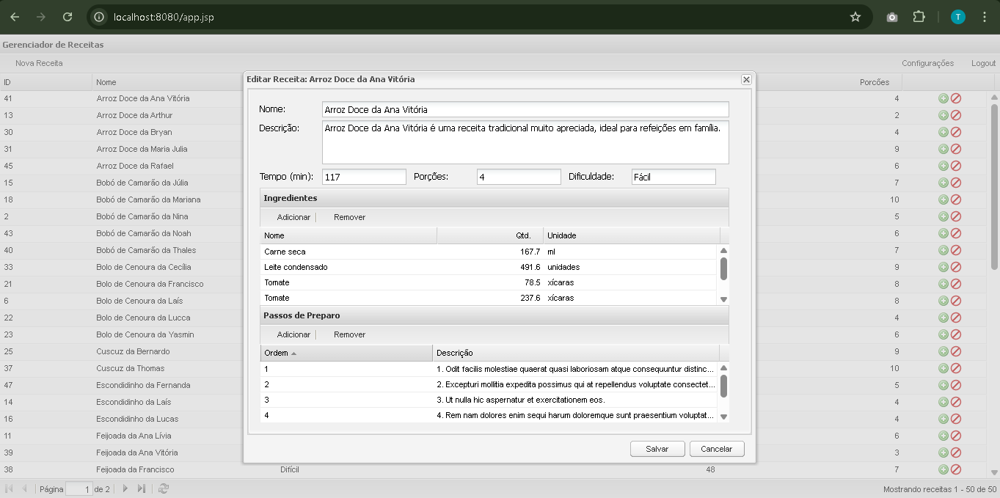

# Documentação Técnica - Sistema Gerenciador de Receitas

## Visão Geral do Sistema

Sistema web monolítico para gerenciamento de receitas culinárias implementado com tecnologias Java Web tradicionais e ExtJS 3.4 no frontend. Utiliza arquitetura em camadas com padrões MVC e DAO, seguindo o conceito de Application Shell para separação total entre server-side e client-side.

### Stack Tecnológica Completa
- **Frontend**: ExtJS 3.4, JavaScript ES5, CSS
- **Backend**: Java Servlets, JDBC puro
- **Servidor**: Apache Tomcat (container-managed resources)
- **Banco de Dados**: PostgreSQL
- **Pool de Conexões**: Tomcat DBCP via JNDI
- **Build/Deploy**: Maven → arquivo .war
- **Serialização**: Gson para JSON
- **Segurança**: BCrypt para hashing de senhas

## Arquitetura Monolítica em Camadas

```
┌────────────────────────────────────────────────────────────────┐
│                        MONÓLITO (.war)                         │
├────────────────────────────────────────────────────────────────┤
│  PRESENTATION LAYER                                            │
│  ┌─────────────────┐    ┌─────────────────┐                    │
│  │   index.jsp     │    │    app.jsp      │                    │
│  │ (Login Shell)   │    │  (App Shell)    │                    │
│  │   <body></body> │    │  <body></body>  │                    │
│  └─────────────────┘    └─────────────────┘                    │
│ ┌────────────────────────────────────────────────────────────┐ │
│ │              ExtJS 3.4 Frontend (SPA)                      │ │
│ │  ┌─────────────┐ ┌─────────────┐ ┌─────────────┐           │ │
│ │  │    Views    │ │   Stores    │ │   Models    │           │ │
│ │  │(UI criada   │ │ (Dados via  │ │ (Estruturas │           │ │
│ │  │dinamicament)│ │   AJAX)     │ │ de dados)   │           │ │
│ │  └─────────────┘ └─────────────┘ └─────────────┘           │ |
│ └────────────────────────────────────────────────────────────┘ │
├────────────────────────────────────────────────────────────────┤
│  CONTROLLER LAYER                                              │
│  ┌────────────────────────────────────────────────────────────┐│
│  │                   Java Servlets                            │|
│  │  ReceitaServlet │ LoginServlet │ UsuarioServlet │ Logout   │|
│  └────────────────────────────────────────────────────────────┘│
├────────────────────────────────────────────────────────────────┤
│  BUSINESS/DATA ACCESS LAYER                                    │
│  ┌───────────────────────────────────────────────────────────┐ │
│  │                    DAO Pattern                            │ │
│  │      ReceitaDAO │ UserDAO (JDBC puro)                     │ │
│  └───────────────────────────────────────────────────────────┘ │
├────────────────────────────────────────────────────────────────┤
│  INFRASTRUCTURE LAYER                                          │
│  ┌───────────────────────────────────────────────────────────┐ │
│  │  AppLifecycleListener │ AuthenticationFilter │ DataSource │ │
│  └───────────────────────────────────────────────────────────┘ │
└────────────────────────────────────────────────────────────────┘
                                │
                                ▼
                    ┌─────────────────────────┐
                    │     PostgreSQL          │
                    │   (External Database)   │
                    └─────────────────────────┘
```

### Conceito de Application Shells

Os arquivos JSP funcionam como **"Application Shells"** - containers HTML mínimos que existem apenas para carregar o ExtJS e inicializar a aplicação JavaScript, diferente do uso tradicional de JSPs para renderização server-side.

#### index.jsp - Shell de Login
```jsp
<%@ page ... %>
<!DOCTYPE html>
<html>
<head>
    <!-- Carrega ExtJS e dependências -->
    <script src="extjs/ext-all-debug.js"></script>
    <script src="js/login.js"></script>
</head>
<body>
    <!-- CORPO COMPLETAMENTE VAZIO -->
    <!-- Interface criada 100% via JavaScript -->
</body>
</html>
```

**Fluxo de Inicialização**:
1. Browser carrega HTML vazio + ExtJS
2. `login.js` executa `Ext.onReady()`
3. ExtJS cria interface de login dinamicamente
4. Após autenticação, JavaScript redireciona para `app.jsp`

#### app.jsp - Shell da Aplicação
```jsp
<%@ page ... %>
<!DOCTYPE html>
<html>
<head>
    <script src="extjs/ext-all-debug.js"></script>
    <script src="js/app-loader.js"></script>
</head>
<body>
    <!-- CORPO COMPLETAMENTE VAZIO -->
    <!-- Aplicação completa criada via ExtJS -->
</body>
</html>
```

**Fluxo de Carregamento**:
1. `app-loader.js` carrega todos os componentes
2. `Ext.Viewport` é criado ocupando 100% da tela
3. Grid principal e toda UI renderizada dinamicamente

## Estrutura do Projeto

```
src/
├── main/
│   ├── java/org/avsytem/
│   │   ├── controller/          # Servlets (Camada de Controle)
│   │   ├── dao/                 # Data Access Objects
│   │   ├── model/               # POJOs (Entidades de Domínio)
│   │   ├── security/            # Filtros de Segurança
│   │   └── listener/            # Gerenciamento de Ciclo de Vida
│   ├── resources/META-INF/      # Configurações CDI/JPA
│   └── webapp/                  # Recursos Web
│       ├── META-INF/context.xml # Configuração DataSource
│       ├── WEB-INF/web.xml      # Configuração Servlets
│       ├── extjs/               # Biblioteca ExtJS 3.4
│       ├── js/app/              # Aplicação JavaScript
│       ├── css/                 # Estilos
│       ├── index.jsp            # Shell de Login
│       └── app.jsp              # Shell da Aplicação
└── ARQUITETURA.md               # Documentação Arquitetural
```

## Camada de Modelo (Model)

### Receita.java
**Localização**: `org.avsytem.model.Receita`

POJO principal que representa uma receita culinária com relacionamentos one-to-many para ingredientes e passos.

**Atributos**:
- `id` (int): Identificador único
- `usuario_id` (int): FK para o usuário proprietário
- `nome` (String): Nome da receita
- `descricao` (String): Descrição detalhada
- `tempoDePreparo` (int): Tempo em minutos
- `porcoes` (int): Número de porções
- `dificuldade` (String): "Fácil", "Médio", "Difícil"
- `ingredientes` (List<Ingrediente>): Lista de ingredientes
- `passos` (List<Passo>): Lista de passos ordenados

**Características**:
- Implementa `equals()` e `hashCode()` para comparação completa incluindo listas
- Método `toString()` customizado com formatação de listas usando Streams
- Inicialização automática das listas no construtor padrão

### Ingrediente.java
**Localização**: `org.avsytem.model.Ingrediente`

Representa um ingrediente de uma receita.

**Atributos**:
- `id` (int): Identificador único
- `receita_id` (int): FK para receita
- `nome` (String): Nome do ingrediente
- `quantidade` (double): Quantidade numérica
- `unidade` (String): Unidade de medida (kg, g, ml, etc.)

### Passo.java
**Localização**: `org.avsytem.model.Passo`

Representa um passo do preparo da receita.

**Atributos**:
- `id` (int): Identificador único
- `receita_id` (int): FK para receita
- `ordem` (int): Ordem de execução do passo
- `descricao` (String): Descrição detalhada do passo

## Camada de Acesso a Dados (DAO)

### ReceitaDAO.java
**Localização**: `org.avsytem.dao.ReceitaDAO`

DAO principal que implementa operações CRUD para receitas usando JDBC puro com otimizações avançadas.

**Características Técnicas**:
- **Pool de Conexões**: Utiliza DataSource injetado via construtor
- **Queries Otimizadas**: Single query com LEFT JOINs para evitar N+1 queries
- **Transações Manuais**: Controle explícito de commit/rollback
- **Batch Processing**: Inserções em lote para ingredientes e passos
- **Mapeamento Eficiente**: LinkedHashMap para agrupar dados relacionados

**Queries SQL Principais**:
```sql
-- Listagem otimizada com JOINs
SELECT r.id AS receita_id, r.nome AS receita_nome, r.descricao AS receita_descricao,
       r.tempo_preparo_min, r.porcoes, r.dificuldade,
       i.nome AS ingrediente_nome, i.quantidade, i.unidade,
       p.ordem AS passo_ordem, p.descricao AS passo_descricao
FROM receitas r
LEFT JOIN ingredientes i ON r.id = i.receita_id
LEFT JOIN passos p ON r.id = p.receita_id
WHERE r.usuario_id = ?
ORDER BY r.nome ASC, p.ordem ASC
```

**Métodos Principais**:
- `listar(int usuarioId)`: Lista receitas com JOIN otimizado
- `adicionar(Receita receita)`: Inserção transacional completa
- `atualizar(Receita receita)`: Atualização com recriação de relacionamentos
- `deletar(int id)`: Deleção em cascata

**Fluxo Transacional de Inserção**:
1. `setAutoCommit(false)`
2. INSERT receita com `RETURN_GENERATED_KEYS`
3. Batch INSERT ingredientes
4. Batch INSERT passos
5. `commit()` ou `rollback()` em caso de erro

### UserDAO.java
**Localização**: `org.avsytem.dao.UserDAO`

DAO para operações de usuário com foco em autenticação e gerenciamento de contas.

**Características**:
- **Hashing de Senhas**: BCrypt para proteção de credenciais
- **Validação de Credenciais**: Método `validarCredenciais()`
- **Gerenciamento de Usuários**: Criação e exclusão de contas

## Modelo de Dados e Estrutura do Banco

### Estrutura Relacional Completa

O sistema utiliza PostgreSQL com 4 tabelas principais organizadas em relacionamentos hierárquicos.

#### Tabela usuarios
```sql
CREATE TABLE usuarios (
    id serial4 NOT NULL,
    username varchar(50) NOT NULL,
    password_hash varchar(255) NOT NULL,
    nome_completo varchar(100) NULL,
    email varchar(100) NULL,
    ativo bool DEFAULT true NULL,
    data_criacao timestamptz DEFAULT CURRENT_TIMESTAMP NULL,
    CONSTRAINT usuarios_email_key UNIQUE (email),
    CONSTRAINT usuarios_pkey PRIMARY KEY (id),
    CONSTRAINT usuarios_username_key UNIQUE (username)
);
```

#### Tabela receitas
```sql
CREATE TABLE receitas (
    id serial4 NOT NULL,
    nome varchar(255) NOT NULL,
    descricao text NULL,
    tempo_preparo_min int4 NULL,
    porcoes int4 NULL,
    dificuldade varchar(50) NULL,
    usuario_id int4 NULL,
    CONSTRAINT receitas_pkey PRIMARY KEY (id),
    CONSTRAINT fk_usuario FOREIGN KEY (usuario_id) REFERENCES usuarios(id)
);
```

#### Tabela ingredientes
```sql
CREATE TABLE ingredientes (
    id serial4 NOT NULL,
    receita_id int4 NULL,
    nome varchar(255) NOT NULL,
    quantidade float8 NULL,
    unidade varchar(50) NULL,
    CONSTRAINT ingredientes_pkey PRIMARY KEY (id),
    CONSTRAINT ingredientes_receita_id_fkey FOREIGN KEY (receita_id) REFERENCES receitas(id) ON DELETE CASCADE
);
```

#### Tabela passos
```sql
CREATE TABLE passos (
    id serial4 NOT NULL,
    receita_id int4 NULL,
    ordem int4 NOT NULL,
    descricao text NOT NULL,
    CONSTRAINT passos_pkey PRIMARY KEY (id),
    CONSTRAINT passos_receita_id_fkey FOREIGN KEY (receita_id) REFERENCES receitas(id) ON DELETE CASCADE
);
```

### Diagrama de Relacionamentos



### Características do Modelo
- **Integridade Referencial**: FKs com CASCADE DELETE para ingredientes e passos
- **Constraints**: UNIQUE em username e email
- **Auditoria**: Campo data_criacao com timestamp automático
- **Flexibilidade**: Campos opcionais para informações complementares

## Camada de Controle (Controllers)

### ReceitaServlet.java
**Localização**: `org.avsytem.controller.ReceitaServlet`

Servlet principal que gerencia operações CRUD de receitas via HTTP.

**Inicialização**:
```java
@Override
public void init() throws ServletException {
    gson = new GsonBuilder().setPrettyPrinting().create();
    ServletContext servletContext = getServletContext();
    DataSource dataSource = (DataSource) servletContext.getAttribute("dataSource");
    this.dao = new ReceitaDAO(dataSource);
}
```

**Endpoints**:
- `GET /receitas?action=listar`: Lista receitas do usuário logado
- `POST /receitas` (jsonData): Cria/atualiza receita baseado no ID
- `POST /receitas?action=deletar&id=X`: Deleta receita específica

**Características**:
- **Serialização JSON**: Gson para conversão automática Java ↔ JSON
- **Validação de Sessão**: Verificação de `usuario_id` em todas as operações
- **Tratamento de Erros**: Responses HTTP apropriados com mensagens JSON
- **Content-Type**: `application/json; charset=ISO-8859-1`

### LoginServlet.java
**Localização**: `org.avsytem.controller.LoginServlet`

Gerencia autenticação de usuários e criação de sessões.

**Fluxo de Autenticação**:
1. Recebe credenciais via POST
2. Valida com `UserDAO.validarCredenciais()`
3. Cria sessão HTTP com `usuario_id` e `username`
4. Retorna JSON de sucesso/falha

### UsuarioServlet.java
**Localização**: `org.avsytem.controller.UsuarioServlet`

Gerencia operações de usuário (cadastro e exclusão).

**Endpoints**:
- `POST /usuarios/`: Cria novo usuário
- `DELETE /usuarios/`: Exclui usuário logado

### LogoutServlet.java
**Localização**: `org.avsytem.controller.LogoutServlet`

Encerra sessões de usuário.

**Funcionalidade**:
- Invalida sessão HTTP
- Redireciona para página de login

## Camada de Segurança

### AuthenticationFilter.java
**Localização**: `org.avsytem.security.AuthenticationFilter`

Filtro que intercepta requisições e valida autenticação.

**Lógica de Proteção**:
```java
boolean loggedIn = session != null 
    && session.getAttribute("username") != null 
    && session.getAttribute("usuario_id") != null;

boolean loginRequest = request.getRequestURI().equals(loginURI) 
    || request.getRequestURI().equals(loginServletURI);

if (loggedIn || loginRequest)
    chain.doFilter(request, response);
else
    response.sendRedirect(loginURI);
```

**Padrões Protegidos**:
- `*.jsp`: Todas as páginas JSP
- `/receitas/*`: Endpoints de receitas

## Gerenciamento de Ciclo de Vida

### AppLifecycleListener.java
**Localização**: `org.avsytem.listener.AppLifecycleListener`

Listener que inicializa recursos da aplicação no startup do container.

**Funcionalidades**:
- **JNDI Lookup**: Obtém DataSource configurado no Tomcat
- **Registry Global**: Armazena DataSource no ServletContext
- **Inicialização Única**: Garante que o pool de conexões seja criado apenas uma vez

```java
@Override
public void contextInitialized(ServletContextEvent sce) {
    Context envContext = (Context) new InitialContext().lookup("java:/comp/env");
    DataSource dataSource = (DataSource) envContext.lookup("jdbc/PostgresDB");
    sce.getServletContext().setAttribute("dataSource", dataSource);
}
```

## Camada de Apresentação (Frontend)

### Arquitetura ExtJS

O frontend utiliza ExtJS 3.4 com padrão MVC client-side e renderização dinâmica completa.

**Características da Arquitetura Frontend**:
- **UI**: Renderizada dinamicamente via JavaScript
- **Arquitetura**: Views, Stores, Models separados
- **Comunicação assíncrona**: AJAX para todas as operações CRUD
- **Componentes ricos**: GridPanel, FormPanel, Window com funcionalidades avançadas

**Estrutura dos Componentes JavaScript**:
```
js/app/
├── model/
│   └── models.js              # Definições os modelos de dados (Ext.data.Record)
├── store/
│   └── ReceitaStore.js        # Faz a requisição dos dados de receitas e armazena na store
└── view/
    ├── ReceitaGrid.js         # Grid principal com paginação que lista todas as receitas do usuario logado
    ├── ReceitaWindow.js       # Formulário que abre uma receita especifica listada em ReceitaGrid
    ├── UsuarioWindow.js       # Tela pra criar um novo usuario
    └── ConfiguracoesWindow.js # Tela pra que o usuario exlua sua conta
```

### Application Shells (JSPs)

#### index.jsp
Shell mínimo para carregar interface de login:
```jsp
<!DOCTYPE html>
<html>
<head>
    <script src="extjs/ext-all-debug.js"></script>
    <script src="js/login.js"></script>
</head>
<body>
    <!-- Corpo vazio - UI criada via JavaScript -->
</body>
</html>
```

#### app.jsp
Shell para aplicação principal:
```jsp
<!DOCTYPE html>
<html>
<head>
    <script src="extjs/ext-all-debug.js"></script>
    <script src="js/app-loader.js"></script>
</head>
<body>
    <!-- Corpo vazio - Viewport ExtJS ocupa 100% -->
</body>
</html>
```

### Componentes JavaScript

#### app-loader.js
Carregador principal que inicializa a aplicação:
```javascript
Ext.onReady(function() {
    Ext.Loader.load([
        'js/app/view/ConfiguracoesWindow.js',
        'js/app/model/models.js',
        'js/app/store/ReceitaStore.js',
        'js/app/view/ReceitaWindow.js',
        'js/app/view/ReceitaGrid.js'
    ], function() {
        Ext.reg('receitagrid', App.view.ReceitaGrid);
        new Ext.Viewport({
            layout: 'fit',
            items: [{ xtype: 'receitagrid' }]
        });
    });
});
```

#### ReceitaStore.js
Store que gerencia dados de receitas:
```javascript
App.store.Receitas = Ext.extend(Ext.data.JsonStore, {
    constructor: function(config) {
        App.store.Receitas.superclass.constructor.call(this, Ext.apply({
            url: 'receitas?action=listar',
            root: 'receitas',
            totalProperty: 'total',
            fields: App.model.Receita,
            remoteSort: true
        }, config));
    }
});
```

#### ReceitaGrid.js
Grid principal com funcionalidades CRUD:
- **Colunas**: ID, Nome, Dificuldade, Tempo, Porções
- **ActionColumn**: Ícones para editar/deletar
- **Toolbar**: Botões Nova Receita, Configurações, Logout
- **PagingToolbar**: Paginação com 30 itens por página

**Características**:
- `loadMask: true`: Indicador de carregamento
- `stripeRows: true`: Linhas alternadas
- `forceFit: true`: Colunas ajustam automaticamente
- `autoExpandColumn`: Coluna nome expande para preencher espaço

#### login.js
Interface de login com FormPanel:
```javascript
var onLogin = function() {
    var form = loginForm.getForm();
    if (form.isValid()) {
        form.submit({
            waitMsg: 'Autenticando...',
            success: function(form, action) {
                window.location = 'app.jsp';
            },
            failure: function(form, action) {
                Ext.Msg.alert('Falha no Login', action.result.message);
            }
        });
    }
};
```

## Configurações do Sistema

### web.xml
Configuração de servlets, filtros e mapeamentos:
```xml
<web-app version="4.0">
    <!-- Servlet Mappings -->
    <servlet-mapping>
        <servlet-name>ReceitaServlet</servlet-name>
        <url-pattern>/receitas</url-pattern>
    </servlet-mapping>
    
    <!-- Security Filter -->
    <filter-mapping>
        <filter-name>AuthenticationFilter</filter-name>
        <url-pattern>*.jsp</url-pattern>
    </filter-mapping>
    
    <!-- Welcome File -->
    <welcome-file-list>
        <welcome-file>index.jsp</welcome-file>
    </welcome-file-list>
</web-app>
```

### context.xml
Configuração do DataSource PostgreSQL:
```xml
<Context>
    <Resource name="jdbc/PostgresDB"
              auth="Container"
              type="javax.sql.DataSource"
              driverClassName="org.postgresql.Driver"
              url="jdbc:postgresql://localhost:5432/postgres"
              username="postgres"
              password=""
              maxTotal="20"
              maxIdle="10"
              maxWaitMillis="10000" />
</Context>
```

**Configuração do Pool de Conexões**:
- **maxTotal**: 20 conexões máximas simultâneas
- **maxIdle**: 10 conexões ociosas mantidas no pool
- **maxWaitMillis**: 10 segundos de timeout para obter conexão
- **JNDI Lookup**: `java:/comp/env/jdbc/PostgresDB`

### Lifecycle Management via Listener

```java
@WebListener
public class AppLifecycleListener implements ServletContextListener {
    @Override
    public void contextInitialized(ServletContextEvent sce) {
        // 1. JNDI lookup do DataSource (apenas uma vez)
        Context envContext = (Context) new InitialContext().lookup("java:/comp/env");
        DataSource dataSource = (DataSource) envContext.lookup("jdbc/PostgresDB");
        
        // 2. Armazena no ServletContext como registry global
        sce.getServletContext().setAttribute("dataSource", dataSource);
    }
}
```

## Endpoints da API REST

| Método | Endpoint | Descrição | Parâmetros | Resposta |
|--------|----------|-----------|------------|----------|
| GET | `/receitas?action=listar` | Lista receitas do usuário logado | - | `{"total": N, "receitas": [...]}` |
| POST | `/receitas` | Cria receita (id=0) ou atualiza (id>0) | `jsonData` com objeto Receita | `{"success": true, "message": "..."}` |
| POST | `/receitas?action=deletar&id=X` | Deleta receita específica | `id` da receita | `{"success": true/false}` |
| POST | `/index` | Autenticação de usuário | `username`, `password` | `{"success": true/false, "message": "..."}` |
| POST | `/logout` | Encerra sessão do usuário | - | Redirect para index.jsp |
| POST | `/usuarios/` | Cria novo usuário | Dados do usuário | `{"success": true/false}` |
| DELETE | `/usuarios/` | Deleta usuário logado | - | `{"success": true/false}` |

**Características dos Endpoints**:
- **Content-Type**: `application/json; charset=ISO-8859-1`
- **Autenticação**: Validação de sessão via AuthenticationFilter
- **Serialização**: Gson para conversão Java ↔ JSON
- **Error Handling**: Status HTTP apropriados com mensagens descritivas

## Fluxos de Dados Principais

### 1. Carregamento de Grid com Paginação



**Detalhes Técnicos**:
- **Query Otimizada**: Single query com LEFT JOINs para evitar N+1 queries
- **Mapeamento Eficiente**: LinkedHashMap para agrupar dados relacionados
- **Serialização**: Gson para conversão automática Java → JSON
- **Paginação**: ExtJS PagingToolbar integrado com backend

### 2. Operação CRUD Transacional



**Características Transacionais**:
- **ACID Compliance**: Transações manuais com rollback automático
- **Batch Processing**: Inserções em lote para ingredientes/passos
- **Generated Keys**: Recuperação automática de IDs gerados
- **Error Handling**: Try-catch com rollback em caso de falha

### 3. Fluxo de Autenticação Completo



**Implementação de Segurança**:
- **Password Hashing**: BCrypt para proteção de senhas
- **Session Management**: HttpSession para estado de autenticação
- **Route Protection**: AuthenticationFilter intercepta requisições protegidas
- **Automatic Redirect**: Redirecionamento transparente para login

### 4. Carregamento Inicial da Aplicação
1. Browser acessa `/` → redireciona para `index.jsp`
2. `AuthenticationFilter` verifica sessão
3. Se não autenticado → carrega `login.js`
4. ExtJS renderiza FormPanel de login dinamicamente

### 2. Processo de Autenticação
1. Usuário submete credenciais via ExtJS FormPanel
2. `LoginServlet` valida com `UserDAO.validarCredenciais()`
3. BCrypt verifica hash da senha
4. Cria sessão HTTP com `usuario_id` e `username`
5. JavaScript redireciona para `app.jsp`

### 3. Carregamento da Aplicação Principal
1. `app.jsp` carrega `app-loader.js`
2. ExtJS carrega componentes em ordem de dependência
3. `Ext.Viewport` é criado ocupando 100% da tela
4. `ReceitaGrid` é renderizado com `ReceitaStore`
5. Store faz requisição AJAX para `/receitas?action=listar`

### 4. Operação CRUD de Receita
1. ExtJS FormPanel serializa dados para JSON
2. `ReceitaServlet` deserializa com Gson
3. `ReceitaDAO` executa transação com batch inserts
4. Resposta JSON retorna sucesso/erro
5. ExtJS atualiza interface baseado na resposta

## Padrões Arquiteturais Implementados

### 1. MVC (Model-View-Controller)
- **Model**: POJOs + DAOs para persistência
- **View**: Componentes ExtJS (client-side rendering)
- **Controller**: Java Servlets processando HTTP

### 2. DAO (Data Access Object)
- Separação clara entre lógica de negócio e acesso a dados
- Encapsulamento de operações SQL complexas
- Reutilização de código de persistência

### 3. Front Controller Pattern
- Servlets como pontos de entrada únicos por funcionalidade
- Roteamento baseado em URL patterns
- Processamento centralizado de requisições

### 4. Application Shell Pattern
- JSPs como containers mínimos para carregar JavaScript
- Separação total entre server-side e client-side

### 5. Dependency Injection Manual
- DataSource injetado via ServletContext
- Lifecycle gerenciado por ServletContextListener
- Recursos compartilhados entre componentes

### 6. Repository Pattern (via DAO)
- Encapsulamento da lógica de acesso a dados
- Interface consistente para operações CRUD
- Abstração da tecnologia de persistência

### 7. Session Management Pattern
- HttpSession para manter estado de autenticação
- AuthenticationFilter para interceptação de requisições
- Timeout automático de sessões inativas

## Características Técnicas Avançadas

### Otimizações de Performance
- **Single Query com JOINs**: Evita N+1 queries usando LEFT JOIN otimizado
- **Connection Pooling**: Reutilização eficiente de conexões via Tomcat DBCP
- **Batch Processing**: Inserções em lote para ingredientes e passos
- **Client-side Rendering**: ExtJS reduz carga do servidor
- **LinkedHashMap Caching**: Agrupamento eficiente de dados relacionados
- **Lazy Loading**: Componentes ExtJS carregados sob demanda

### Segurança Implementada
- **BCrypt Hashing**: Proteção robusta de senhas com salt automático
- **Session Management**: Controle de estado via HttpSession
- **Authentication Filter**: Proteção automática de rotas sensíveis
- **SQL Prepared Statements**: Prevenção total de SQL Injection
- **CSRF Protection**: Validação de origem via session tokens
- **Input Validation**: Sanitização de dados no frontend e backend

### Gerenciamento de Recursos
- **DataSource JNDI**: Pool de conexões gerenciado pelo container Tomcat
- **Lifecycle Listener**: Inicialização controlada de recursos na startup
- **Try-with-resources**: Fechamento automático de conexões JDBC
- **Transaction Management**: Controle manual com rollback automático
- **Memory Management**: Liberação adequada de ResultSets e Statements
- **Connection Timeout**: Configuração de timeouts para evitar deadlocks

### Arquitetura de Frontend Avançada
- **Component-based Architecture**: Componentes ExtJS reutilizáveis
- **Event-driven Programming**: Sistema de eventos para comunicação entre componentes
- **AJAX Asynchronous**: Todas as operações sem reload de página
- **JSON Serialization**: Comunicação eficiente via Gson
- **Client-side Validation**: Validação imediata antes do envio
- **Progressive Enhancement**: Funcionalidade básica sem JavaScript

### Padrões de Desenvolvimento
- **Separation of Concerns**: Camadas bem definidas e isoladas
- **Single Responsibility**: Cada classe com responsabilidade única
- **Open/Closed Principle**: Extensível sem modificar código existente
- **Dependency Inversion**: Dependências via interfaces e injeção
- **Error Handling**: Tratamento consistente de exceções em todas as camadas
- **Logging Strategy**: Sistema de logs para debugging e monitoramento

## Dependências e Tecnologias

### Backend
- **Java Servlets 4.0**: Controllers HTTP
- **JDBC PostgreSQL**: Acesso a dados
- **Gson**: Serialização JSON
- **BCrypt**: Hashing de senhas
- **Apache Tomcat**: Container web

### Frontend
- **ExtJS 3.4**: Framework JavaScript
- **CSS**: Estilos customizados
- **JSP**: Application shells

### Banco de Dados
- **PostgreSQL**: SGBD relacional robusto
- **JDBC Driver**: Conectividade Java nativa

## Análise Arquitetural Final

### Pontos Fortes da Implementação

**Arquitetura Sólida**:
- Separação clara de responsabilidades em camadas bem definidas
- Padrões arquiteturais consolidados (MVC, DAO, Front Controller)
- Application Shell pattern inovador para a época (2010-2012)

**Performance Otimizada**:
- Queries SQL otimizadas com JOINs para evitar N+1 queries
- Pool de conexões gerenciado pelo container
- Renderização client-side reduzindo carga do servidor
- Batch processing para operações em lote

**Segurança Robusta**:
- BCrypt para hashing de senhas (padrão da indústria)
- Authentication Filter interceptando todas as requisições
- Prepared Statements prevenindo SQL Injection
- Session management adequado

**Tecnologias Adequadas ao Contexto**:
- ExtJS 3.4 era tecnologia de ponta para RIA (Rich Internet Applications)
- Java Servlets + JDBC ofereciam controle total sobre performance
- PostgreSQL como SGBD enterprise-grade
- Maven para build automation

### Características Inovadoras para a Época

**Application Shell Concept**:
- JSPs como meros containers HTML (conceito precursor do SPA moderno)
- Separação total entre server-side e client-side
- UI 100% renderizada via JavaScript

**Rich Internet Application**:
- Interface desktop-like no browser
- Componentes avançados (Grid com paginação, FormPanels, Windows)
- Comunicação assíncrona total via AJAX

**Enterprise Patterns**:
- Dependency Injection manual via ServletContext
- Lifecycle management adequado
- Resource pooling gerenciado pelo container

Este sistema demonstra uma implementação madura e bem arquitetada de aplicação web monolítica, utilizando as melhores práticas disponíveis no período de desenvolvimento (2010-2015), com padrões que permanecem relevantes e técnicas que anteciparam conceitos modernos como SPAs e component-based architecture.

## Imagens das telas do sistema:

### Tela de Login:
Essa é a tela inicial de quando se acessa o sistema: 


### Tela de lisagem das receitas:
Tela principal, exbibida apos login no sistema:



### Tela de Criação de nova receita:

Tela aberta ao clicar no botão da receita



### Tela de Criação de nova receita:

Tela aberta Ao clicar em configurar conta que permite ao usuario excluir seus dados



### Tela de edição de receita:

Tela aberta ao clicar no botão . E Igual a tela de adição de receitas, mas com os dados da receita que ta sendo editada carregado



### Botão de remoção de receita:

Botão na linha que especifica a receita listada para deletrar a receita


